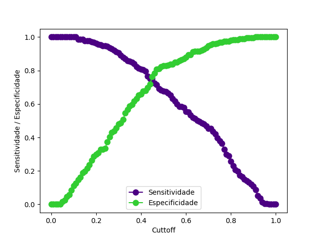
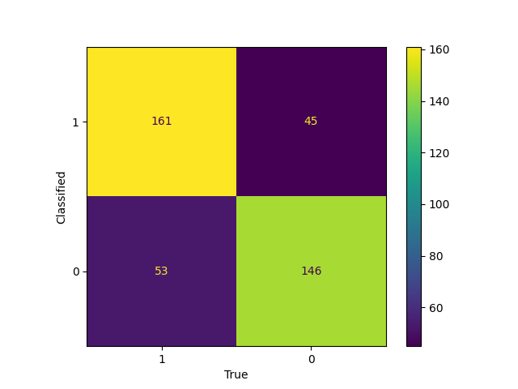

# Classification of Occurrences on BR-381: Application of Supervised Models for Accident Prevention


## Summary
1. [Description](#description)
2. [Repository Structure](#repository-structure)
3. [Installation](#installation)
4. [Data](#data)
5. [Pre-processing of Data](#pre-processing-of-data)
6. [Descriptive Analysis](#descriptive-analysis)
7. [Models](#models)
8. [Training](#training)
9. [Evaluation](#evaluation)
10. [Results](#results)
11. [Contribution](#contribution)
12. [License](#license)
13. [Contact](#contact)


## Description
Road accidents are a significant concern for governments worldwide. The BR-381, often referred to as the "Death Road" in Brazil, recorded 3,285 accidents and 199 deaths in 2023. The cost of these accidents is estimated at 530 million reais.

Based on this information, methods have been considered to predict the likelihood of a driver being involved in an accident, taking into account factors such as rain, road characteristics, and traffic conditions, including average speed and vehicle volume.


## Repository Structure
This is the directory and file structure of the project:

- **data/**: Stores data used in the project.
  - **raw/**: Raw data, without preprocessing.
  - **processed/**: Preprocessed data, ready for modeling.

- **mlartifacts/**: Directory to store machine learning artifacts, such as trained models or generated files.

- **mlruns/**: Directory where MLflow stores logs and metadata of experiments.

- **notebooks/**: Jupyter notebooks for data exploration and analysis.
  - **descr_analysis.py**: Contains all of the descriptive analysis.

- **src/**: Contains the project’s source code.
  - **mlruns/**: Subdirectory for specific MLflow run files (if you need to separate logs).
  - **utils/**: Auxiliary functions used in different parts of the project.
    - **functions.py**: Contains all functions used.
  - **lb_model.py**: Binary Logistic Regression model.
  - **rf_model.py**: Random Forest model.
  - **xgb_model.py**: XGBoost model.

- **requirements.txt**: List of required libraries and dependencies for the project.

- **README.md**: Main project documentation.


## Installation
1. Clone the repository:
    ```bash
    git clone https://github.com/Ferruccio1997/supervisedml_tcc_usp
    cd supervisedml_tcc_usp
    ```

2. Create a virtual environment and activate it:
    ```bash
    python -m venv .venv
    ```

    - On Windows:
      ```bash
      source .venv\Scripts\activate
      ```

    - On macOS/Linux:
      ```bash
      source .venv/bin/activate
      ```

3. Install all dependencies:
    ```bash
    pip install -r requirements.txt
    ```

4. (Optional) Run MLflow to track experiments:
    ```bash
    mlflow ui
    ```
    This will open the MLflow interface at `http://localhost:5000`.


## Data
This project uses traffic accident records collected on the BR-381 highway, along with weather data and various road characteristics. The dataset combines information from multiple sources to provide a comprehensive view of the factors influencing accident likelihood and severity.

### Data Sources
The data includes:

- **Traffic Accident Records**: Information on accidents reported on the BR-381 highway, including details on accident types, times, and locations. Available at [PRF Open Data](https://www.gov.br/prf/pt-br/acesso-a-informacao/dados-abertos/dados-abertos-da-prf)

- **Weather Records**: Weather data collected from [SNIRH Historical Series](https://www.snirh.gov.br/hidroweb/serieshistoricas) and [CEMADEN Interactive Map](https://mapainterativo.cemaden.gov.br/#)

- **Road Characteristics**: Road data describing conditions on BR-381, such as illumination, solo type and road type. Available at [ANTT Terrain Profile](https://dados.antt.gov.br/dataset/perfil-do-terreno),  [ANTT Illumination Data](https://dados.antt.gov.br/dataset/iluminacao) and [ANTT Road Data](https://dados.antt.gov.br/dataset/tipo-faixa)

- **Vehicle Velocity and Volume**: Average speed and volume of vehicles passing through, available at [Vehicle Volume Data](https://dados.gov.br/dados/conjuntos-dados/volume-radar)

### Data Structure
The data includes several key columns:

- **km**: Kilometer location of the radar.
- **municipio**: City where the record was made.
- **data**: Date of the record.
- **sentido_crescente**: Direction of the record (indicates if it’s one way or another).
- **uf**: State of the record.
- **Velocidade_Comercial**: Average speed of commercial vehicles.
- **Velocidade_Moto**: Average speed of motorcycles.
- **Velocidade_Passeio**: Average speed of cars.
- **Velocidade_Ônibus**: Average speed of buses.
- **Volume_Comercial**: Volume (count) of commercial vehicles.
- **Volume_Moto**: Volume (count) of motorcycles.
- **Volume_Passeio**: Volume (count) of cars.
- **Volume_Ônibus**: Volume (count) of buses.
- **acidentes**: Indicates whether an accident occurred (binary).
- **chuva**: Indicates if it was raining (binary).
- **dia_da_semana**: Indicates if it was a weekday or weekend.
- **mes**: Month of the record.
- **tipo_faixa**: Type of road section (e.g., presence of shoulder or multiple lanes).
- **tipo_perfil_de_terreno**: Type of terrain (e.g., flat, hilly).
- **iluminacao**: Indicates whether the road section has illumination.

## Pre-processing of Data

The data required significant pre-processing steps to unify and prepare it for modeling. Below are the key steps performed:

1. **Merging Rain Data**: 
   - Combined multiple datasets containing rain information.
   - Created a binary variable (`chuva`) indicating whether it was raining (1) or not (0) at the time of the record.

2. **Filtering Accident Data**:
   - Applied filters to include only relevant cities and specific sections of the BR-381 highway.
   - This step ensured the dataset focused on the areas of interest for the analysis.

3. **Aggregating Speed Data**:
   - Calculated the average speed (`Velocidade`) for each type of vehicle (commercial vehicles, motorcycles, cars, buses) per radar section.
   - Summed the count of each type of vehicle in the `Volume` columns to get a total vehicle count by type for each record.

4. **Including Road Characteristics**:
   - Merged datasets that described the road characteristics, such as terrain type and illumination.
   - These features provide context on road conditions, which may affect accident rates and vehicle behavior.

5. **Unifying Datasets**:
   - Unified all datasets using the kilometer marker as the main key, ensuring alignment across sources.
   - For rain data, matched the rain information based on the distance to the nearest weather station.
   - Included accidents that occurred within a 10 km radius of each radar record to capture nearby incidents relevant to the location.

Each of these steps was essential to create a cohesive dataset with complete information on weather, accidents, vehicle speed and volume, and road characteristics for modeling purposes.

## Descriptive Analysis

### Overview

This analysis explores various factors contributing to road accidents across different regions. Each section includes visualizations that help highlight key trends and insights derived from the data.

#### Accident Frequency by Municipality

The first two municipalities, Betim and São Paulo, account for approximately 431 of the 675 accident days, representing over 60% of the total. As shown in **Figure 1: Accident Frequency by Municipality**, these municipalities have significantly higher accident frequencies than others, which may be attributed to factors like higher traffic volume, specific road conditions, or more critical sections for road safety. This concentration suggests that Betim and São Paulo require further analysis to identify the variables contributing to accidents in these areas.


#### Accident Days by Terrain Type

Terrain type plays a crucial role in accident occurrence. As depicted in **Figure 2: Accident Days by Terrain Type**, mountainous terrain experiences the highest number of accident days, totaling 306. This trend could result from the challenges of building highways in mountainous regions, which often feature numerous curves and limited lane options. In contrast, the increased sense of safety on flat terrain may encourage higher speeds, raising collision risk.


#### Accident Distribution Near Speed Cameras

**Figure 3: Accident Distribution Near Speed Cameras** presents accident frequencies within a ten-kilometer radius of speed cameras, pinpointing road sections with high accident frequencies. Notably, kilometer 493.29, located in Betim, emerges as a hotspot.


#### Accident Count by Lane Type

Lane type impacts accident likelihood, as shown in **Figure 4: Accident Count by Lane Type**. The third lane records the most accidents, likely due to increased vehicle volume. The presence of a third lane often encourages more passing maneuvers, leading to greater collision risks, especially in high-traffic conditions.


#### Accident Frequency by Day of the Week

The day of the week influences accident frequency. Contrary to initial expectations, weekday accidents are more prevalent than those on weekends. **Figure 5: Accident Frequency by Day of the Week** suggests that commercial vehicles and work-related stress might contribute to this pattern. Professional drivers and commuters are particularly susceptible to fatigue and distraction, raising collision risks during weekday traffic.


#### Accident Frequency by Road Lighting

Lighting conditions significantly impact accident rates. In **Figure 6: Accident Frequency by Road Lighting**, 74% of accidents occur on unlit sections. Poor lighting reduces driver visibility, especially at night, emphasizing the need for improved infrastructure like enhanced lighting systems.


#### Accident Count by Direction of Travel

Direction of travel also plays a role, as illustrated in **Figure 7: Accident Count by Direction of Travel**. The section heading toward Belo Horizonte shows a higher accident rate, possibly due to a heavier flow of trucks moving between São Paulo and Minas Gerais. Differences in altitude and visibility between directions may further influence this pattern.


#### Accident Frequency by Weather Conditions

Weather conditions affect driving risk. As depicted in **Figure 8: Accident Frequency by Weather Conditions**, fewer accidents occur on rainy days, as rain may discourage road usage. **Figure 9: Traffic Volume Reduction on Rainy Days** further illustrates this trend, showing a reduction in traffic volume across all vehicle types on rainy days.


#### Average Speeds on Accident Days

Average speeds decrease slightly on accident days due to lane closures for emergency assistance. **Figure 10: Average Speeds on Accident Days** demonstrates this variation, underscoring the impacts of accidents on road speeds.


#### Vehicle Volume on Accident Days

Finally, vehicle volume on accident days shows an increase across all categories, as depicted in **Figure 11: Vehicle Volume on Accident Days**. In particular, motorcycle volumes are significantly higher on accident days, which may contribute to accident frequency.


## Models

This project compares three models with the objective of predicting the probability of accidents. Below are the models and their configurations:

### Tested Models

1. **Binary Logistic Regression**  
   This model is commonly used for binary classification problems, where the goal is to predict one of two possible outcomes. It calculates the probability of an event (such as an accident) occurring, making it suitable for estimating accident probabilities based on input features.

2. **Random Forest**  
   An ensemble learning method that builds multiple decision trees and combines their outputs to improve accuracy and reduce overfitting. Random Forest is robust and effective for handling complex data, making it well-suited for predicting accident probabilities by capturing various patterns in the data.

3. **eXtreme Gradient Boosting (XGBoost)**  
   A high-performance, gradient-boosted algorithm known for its efficiency and accuracy. XGBoost is often used in predictive modeling competitions and is effective at capturing non-linear relationships, making it ideal for complex data sets where accident patterns may not be straightforward.

### Hyperparameters Used

 1. **Binary Logistic Regression**
  This model was used with default settings, without specific hyperparameter tuning.

 2. **Random Forest**
    - `n_estimators`: Number of trees in the forest. Values tested: [100, 200, 500, 1000].
    - ``max_depth``: Maximum depth of each tree, controlling model complexity. Values tested: [4, 6, 8, 10, 11].
    - ``min_samples_split``: Minimum number of samples required to split an internal node, impacting tree depth and complexity. Values tested: [2, 5, 10, 15, None].
  	- ``min_samples_leaf``: Minimum number of samples required at each leaf node, reducing overfitting. Values tested: [1, 2, 4, 10, None].
    - ``bootstrap``: Whether to sample with replacement (True) or without replacement (False) for each tree. Values tested: [True, False].
    - ``max_features``: Number of features to consider when looking for the best split, controlling variance and generalization. Values tested: ['auto', 'sqrt', 'log2'].

 3. **eXtreme Gradient Boosting (XGBoost)**
    - ``n_estimators``: Number of boosting rounds. Values tested: [100, 200, 500].
    - ``learning_rate``: Step size for each iteration, affecting the rate of convergence. Values tested: [0.01, 0.05, 0.1].
    - ``max_depth``: Maximum depth of each tree, controlling model complexity. Values tested: [4, 6, 8].
    - ``subsample``: Fraction of samples used per tree, helping reduce overfitting. Values tested: [0.8, 1, None].
    - ``colsample_bytree``: Fraction of features sampled per tree, promoting robustness. Values tested: [0.8, 1, None].
    - ``gamma``: Minimum loss reduction required to make a further partition on a leaf node. Values tested: [0, 0.1, 0.3].

### Hyperparameter Tuning

To optimize the performance of the models, I conducted hyperparameter tuning through a combination of manual tuning, Grid Search, and Random Search. For all experiments with Random Forest and XGBoost, a fixed seed (`seed = 10`) was used to ensure consistency and reproducibility of results. Here’s an overview of the process for each model:

1. **Random Forest**

   - **Manual Tuning**: Initially, I manually adjusted key parameters, exploring a maximum depth range of 4 to 12. The best combination was achieved with `max_depth = 11`, `n_estimators = 500`, and `criterion = 'gini'`.

   - **Grid Search**: I then applied Grid Search to systematically explore a broader range of parameters. The configuration used was:
     ```python
     criterio = 'gini'
     param_grid = {
         'n_estimators': [100, 200, 500, 1000],
         'max_depth': [4, 6, 8, 10, 11],
         'min_samples_split': [2, 5, 10, 15, None],
         'min_samples_leaf': [1, 2, 4, 10, None],
         'bootstrap': [True, False],
         'max_features': ['auto', 'sqrt', 'log2']
     }
     kfold = 3
     scor = 'roc_auc'
     ```

   - **Random Search**: To further fine-tune the parameters and reduce computation time, I followed up with Random Search using the same parameter grid as above.

2. **XGBoost**

   - **Manual Tuning**: For XGBoost, I initially adjusted the `max_depth` (values between 1 and 6) and `learning_rate` (values of 0.05, 0.01, and 0.005) to observe their impact on model performance.

   - **Grid Search**: After initial adjustments, I used Grid Search with the following configuration:
     ```python
     objetivo = 'binary:logistic'
     param_grid = {
         'n_estimators': [100, 200, 500],
         'learning_rate': [0.01, 0.05, 0.1],
         'max_depth': [4, 6, 8],
         'subsample': [0.8, 1, None],
         'colsample_bytree': [0.8, 1, None],
         'gamma': [0, 0.1, 0.3]
     }
     kfold = 3
     scor = 'roc_auc'
     ```

   - **Random Search**: Finally, I applied Random Search with the same parameters to capture the best configuration without needing to test every combination in the grid.

By using both Grid Search and Random Search after initial manual tuning, I was able to efficiently explore a comprehensive range of parameters to maximize model performance, specifically optimizing for the `roc_auc` score with 3-fold cross-validation (`kfold = 3`), and ensuring consistent results with `seed = 10`.

### Modeling Pipeline

Each model was integrated into the MLflow pipeline, allowing all executions to automatically record parameters, metrics, and the model itself. This setup enabled comparison of different model versions and assessment of hyperparameter adjustments' effectiveness.

### Model Versioning and Comparison with MLflow

MLflow was used to:

- **Track Experiments**: Each model and configuration was logged, facilitating the comparison of AUC-ROC.
- **Store Models**: Each model version was stored in MLflow, allowing for easy retrieval for future evaluations or adjustments.

## Training

The training process involved several steps to ensure each model was properly trained and evaluated. The main components of the training process were as follows:

1. **Data Split**: The dataset was divided into training and testing sets, with [specify the percentage, e.g., 70% for training and 30% for testing] to evaluate model performance on unseen data.

2. **Model Training**: Each model was trained with a set of optimized hyperparameters (see the Hyperparameter Tuning section) to predict accident probabilities. For Binary Logistic Regression, **stepwise selection** was used to identify the most relevant features, adding or removing variables iteratively based on statistical significance. This process ensured that only the most impactful features were included, enhancing model accuracy and generalization. Training involved iterative tuning and validation to achieve high accuracy and robust performance across models.

3. **MLflow Integration**: 
   - MLflow was used to log each training experiment, capturing key metric AUC-ROC. This facilitated easy tracking and comparison of models.
   - Parameters, metrics, and artifacts were stored in MLflow to allow for seamless retrieval and further analysis of each model version.

4. **Reproducibility**: To ensure consistency in training results, a fixed random seed (`seed = 10`) was applied for each model, enabling reproducibility across experiments.

5. **Executing the Training Process**: 

   The training scripts (`lb_model.py`, `rf_model.py`, `xgb_model.py`) is structured to run all model configurations sequentially, logging each experiment in MLflow. Each model, along with its different hyperparameter configurations, is executed in a loop, and results are tracked and stored automatically.

   To execute the training process:
   - Run the script directly to train all models and configurations in sequence:
     ```bash
     python src/lb_model.py.py
     ```
     ```bash
     python src/rf_model.py.py
     ```
     ```bash
     python src/xgb_model.py.py
     ```
   - Ensure that MLflow is set up and running, as each experiment’s parameters, metrics, and artifacts will be logged for easy tracking and comparison.

**Note**: This setup means all configurations will be executed in a single run. If you prefer running individual configurations, you can modify the script to run specific model setups or comment out sections not required for a given execution.

## Evaluation

The evaluation process aimed to determine the effectiveness and reliability of each model in predicting accident probabilities. Here’s an overview of the evaluation components:

1. **Evaluation Metrics**:
   - **AUC-ROC (Area Under the Curve - Receiver Operating Characteristic)**: Measures the model's ability to distinguish between classes, with a higher AUC indicating better performance.
   - **Accuracy**: The overall correctness of predictions.
   - **Specificity**: The proportion of true negative predictions out of all actual negative cases.
   - **Recall (Sensitivity)**: The ability of the model to correctly identify all positive instances.

2. **Validation Technique**:
   - **Cross-Validation (K-fold)**: To ensure robust evaluation, each model was validated using K-fold cross-validation (with `k=3`). This approach provides a more reliable measure of model performance by evaluating it on multiple folds of data.
   - **Test Set Evaluation**: After tuning and validation, the models were evaluated on an independent test set to assess their generalization performance on unseen data.

3. **MLflow Tracking**:
   - All evaluation metrics for each model and configuration were logged in MLflow, enabling easy comparison across experiments. This facilitated selection of the best-performing model by comparing AUC-ROC.

4. **Results Analysis**:
   - After logging each model's metrics, the results were analyzed to identify the model that best balanced accuracy, precision, and recall. The AUC-ROC was a key metric for comparing performance, as it reflects the model's ability to handle both classes effectively.
   - The model with the best performance was selected as the final model for predicting accident probabilities.

5. **Visualizations**:
   - Visualizations of ROC curves were generated to provide deeper insight into each model’s performance. These visuals were stored in MLflow as artifacts, offering a visual comparison of model capabilities. Additionally, the confusion matrix of the final model and Recall x Precision plot was generated.

## Results

The table below displays the principal results of all models evaluated:

| Model                            |   AUC-ROC   |   GINI     |
|----------------------------------|-------------|------------|
| Binary Logistic Reg.             |   0.7676    |   0.5352   |
| Initial Random Forest            |   0.7872    |   0.5744   |
| Final Random Forest              |   0.8142    |   0.6285   |
| GridSearch Random Forest         |   0.8094    |   0.6188   |
| RandomlySearch Random Forest     |   0.7996    |   0.5991   |
| Initial XGBoost                  |   0.7900    |   0.5801   |
| **Final XGBoost**                | **0.8266**  | **0.6532** |  
| GridSearch XGBoost               |   0.8081    |   0.6161   |
| RandomlySearch XGBoost           |   0.8166    |   0.6331   |

After testing multiple models and configurations, **Final XGBoost** emerged as the best-performing model based on AUC-ROC, demonstrating its superior ability to classify accident and non-accident cases. Key results and insights are detailed below:

### 1. **Final XGBoost Performance**
   The Final XGBoost model underwent targeted adjustments, including setting the `max_depth` to 5 and reducing the `learning_rate` to 0.01. These modifications led to the highest AUC-ROC score observed in the study:
   - **AUC-ROC**: 0.8266
   - **Accuracy**: 0.7580
   - **Specificity**: 0.7523
   - **Recall**: 0.7644

   These metrics indicate the model’s robustness in predicting accident probability while balancing sensitivity and specificity, essential for applications where both accurate identification of accident-prone cases and avoidance of false positives are critical.

### 2. **Specificity vs. Recall Analysis**
   **Figure 12: Specificity vs. Recall** (see below) illustrates the trade-off between specificity and recall across different threshold settings for the Final XGBoost model. This analysis helps in identifying the optimal threshold that maximizes recall without compromising specificity excessively, allowing for a balanced approach in high-stakes accident prediction scenarios.

   

### 3. **Confusion Matrix at Optimal Threshold**
   The Confusion Matrix at the optimal threshold, shown in **Figure 13: Confusion Matrix**, provides a detailed view of true positives, true negatives, false positives, and false negatives. This matrix underscores the model’s accuracy in distinguishing between accident-prone and safer cases, confirming its practical applicability for road safety enhancement.

   

### 4. **Key Insights from Model Selection**
   During the stepwise selection for Binary Logistic Regression, four variables were excluded at a 5% significance level (p-value ≤ 0.05):
   - **tipo_perfil_de_terreno_Perfil_Ondulado**
   - **velocidade_Ônibus**
   - **volume_Comercial**
   - **tipo_perfil_de_terreno_Perfil_Plano**

   As a result, the original variable **tipo_perfil_de_terreno** was completely removed, suggesting that this feature did not significantly contribute to predicting accident probability within the logistic regression model framework.

### Summary

The **Final XGBoost** model, with its high AUC-ROC and balanced accuracy metrics, stands out as the most effective model for accident prediction. The Specificity vs. Recall plot (Figure 12) and the Confusion Matrix (Figure 13) validate the model’s capacity to perform reliably across different scenarios. These results highlight the model’s suitability for practical applications, providing reliable predictions that could inform proactive measures in road safety management.

## Contribution

We welcome contributions to improve the accuracy, performance, and scope of this accident prediction model. Here’s how you can contribute:

1. **Identify and Report Issues**: If you encounter bugs, issues, or areas of improvement, feel free to create an issue in the repository.

2. **Suggest or Implement Enhancements**: Ideas for new features, alternative models, or optimization methods are welcome. You can submit a pull request (PR) with your proposed changes or open an issue to discuss it.

3. **Add Documentation**: Improvements in documentation, including code comments, explanations of specific functions, or expanded README sections, are highly appreciated.

4. **Optimize Code**: If you have insights on optimizing the code (e.g., refactoring for performance, reducing memory usage), feel free to submit a PR.

5. **Perform Model Evaluation on Additional Datasets**: To generalize the model's robustness, try running it on other datasets and provide feedback or results.

### Getting Started

To start contributing:
1. Fork the repository.
2. Clone your fork to your local machine.
3. Create a new branch for your work.
4. Once your changes are complete, submit a pull request describing your changes.

Please follow the coding guidelines outlined in the repository and ensure your code passes all tests before submitting.

For major changes, it’s best to open a discussion issue first so we can align on objectives and approaches.

Thank you for your interest in enhancing this project!

## Contact

If you have any questions, feedback, or suggestions, feel free to reach out!

- **Project Maintainer**: Ferruccio Ribeiro
- **Email**: [ferruccioribeiro@outlook.com](mailto:ferruccioribeiro@outlook.com)
- **LinkedIn**: [Ferruccio Leal Ribeiro](https://www.linkedin.com/in/ribeiroferruccio)
- **GitHub Issues**: For reporting bugs or suggesting features, please create an issue in this repository.

We’re open to discussing potential collaborations or improvements to the model. Thank you for your interest in this project!


